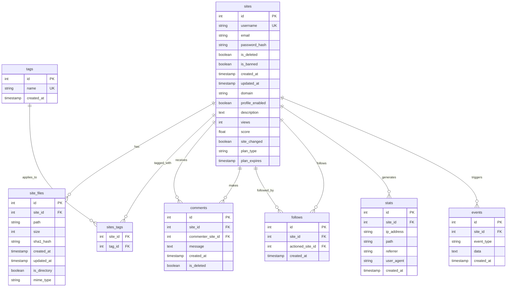

# Neocities Technical Architecture Documentation

## Table of Contents
- [System Overview](#system-overview)
- [Application Architecture](#application-architecture)
- [Database Schema](#database-schema)
- [API Architecture](#api-architecture)
- [Security Architecture](#security-architecture)
- [Background Jobs & Workers](#background-jobs--workers)
- [Deployment & Infrastructure](#deployment--infrastructure)
- [Data Flow](#data-flow)
- [Key Components](#key-components)
- [Development Guidelines](#development-guidelines)

## System Overview

Neocities is a web hosting service built with Ruby using the Sinatra framework. It provides free static website hosting with a simple file upload interface, social features, and an API for programmatic access.


### Technology Stack
- **Backend**: Ruby with Sinatra framework
- **Database**: PostgreSQL with Sequel ORM
- **Caching**: Redis with Redis Namespace
- **Background Jobs**: Sidekiq
- **File Processing**: ImageMagick, ImageOptim
- **Authentication**: BCrypt for password hashing
- **Payments**: Stripe integration
- **SSL**: Let's Encrypt automation
- **CSS**: Sass preprocessing
- **Testing**: Minitest with Fabrication for fixtures

## Application Architecture

The application follows a modular Sinatra architecture with separate route handlers for different functional areas.


### Request Flow


## Database Schema

The database uses PostgreSQL with the Sequel ORM. Key entities and their relationships:



### Key Database Features
- **Paranoid Deletion**: Soft deletes using `is_deleted` flags
- **Timestamping**: Automatic `created_at` and `updated_at` timestamps
- **Indexing**: Optimized indexes for common query patterns
- **Validation**: Model-level validation helpers
- **Migrations**: Sequel migrations for schema changes

## API Architecture

The Neocities API provides programmatic access to site management functions.

```mermaid
graph TB
    subgraph "API Endpoints"
        Auth[Authentication]
        Info[/info - Site Information]
        List[/list - File Listing]
        Upload[/upload - File Upload]
        Delete[/delete - File Deletion]
        WebDAV[WebDAV Interface]
    end
    
    subgraph "Authentication Methods"
        Basic[HTTP Basic Auth]
        Token[API Token]
    end
    
    subgraph "Response Formats"
        JSON[JSON Responses]
        XML[XML for WebDAV]
    end
    
    Client --> Auth
    Auth --> Basic
    Auth --> Token
    
    Auth --> Info
    Auth --> List
    Auth --> Upload
    Auth --> Delete
    Auth --> WebDAV
    
    Info --> JSON
    List --> JSON
    Upload --> JSON
    Delete --> JSON
    WebDAV --> XML
```

### API Request Flow


## Security Architecture

Neocities implements multiple layers of security controls:


### Security Features
- **CSRF Protection**: All forms include CSRF tokens
- **Password Security**: BCrypt hashing with salt
- **File Upload Security**: MIME type validation and file size limits
- **Content Security Policy**: Strict CSP headers to prevent XSS
- **SQL Injection Prevention**: Parameterized queries via Sequel ORM
- **Session Security**: HTTPOnly, Secure, and SameSite cookie flags

## Background Jobs & Workers

Asynchronous processing is handled by Sidekiq workers:


### Worker Processing Flow


## Deployment & Infrastructure


## Data Flow

### File Upload Flow


### User Registration Flow


## Key Components

### Site Model
The central model representing a user's website:
- **File Management**: Handles file uploads, validation, and storage
- **Authentication**: User login and password management
- **Billing**: Integration with Stripe for premium plans
- **Statistics**: Page view tracking and analytics
- **Social Features**: Following, comments, and discovery

### File Upload System
- **Validation**: File type, size, and content validation
- **Storage**: Organized file system storage with user directories
- **Processing**: Automatic thumbnail and screenshot generation
- **Versioning**: File change tracking and history

### API System
- **REST API**: Standard HTTP methods for CRUD operations
- **WebDAV**: Standard protocol for file management
- **Authentication**: HTTP Basic Auth and API tokens
- **Rate Limiting**: Prevents abuse and ensures fair usage

### Background Processing
- **Email Delivery**: Asynchronous email sending
- **Image Processing**: Thumbnail and screenshot generation
- **SSL Management**: Automated certificate provisioning and renewal
- **Cache Management**: Intelligent cache invalidation

## Development Guidelines

### Getting Started
1. **Environment Setup**: Use Vagrant for consistent development environment
2. **Configuration**: Copy `config.yml.template` to `config.yml`
3. **Dependencies**: Run `bundle install` to install Ruby gems
4. **Database**: Migrations run automatically on startup
5. **Testing**: Use `rake test` to run the test suite

### Code Organization
- **Models**: Business logic and data access in `/models`
- **Routes**: HTTP request handling in `/app`
- **Views**: ERB templates in `/views`
- **Workers**: Background jobs in `/workers`
- **Tests**: Comprehensive test coverage in `/tests`

### Development Workflow
1. **Feature Branches**: Create feature branches for new work
2. **Testing**: Write tests for new functionality
3. **Code Review**: Submit pull requests for review
4. **Documentation**: Update documentation for new features
5. **Deployment**: Use CI/CD pipeline for automated deployment

### Performance Considerations
- **Database Queries**: Use eager loading to avoid N+1 queries
- **Caching**: Implement appropriate caching strategies
- **File Storage**: Optimize file storage and delivery
- **Background Jobs**: Use workers for expensive operations
- **Monitoring**: Track performance metrics and errors

### Security Best Practices
- **Input Validation**: Validate all user inputs
- **SQL Injection**: Use parameterized queries
- **XSS Prevention**: Escape output and use CSP headers
- **CSRF Protection**: Include CSRF tokens in forms
- **File Upload Security**: Validate file types and sizes
- **Authentication**: Use secure session management