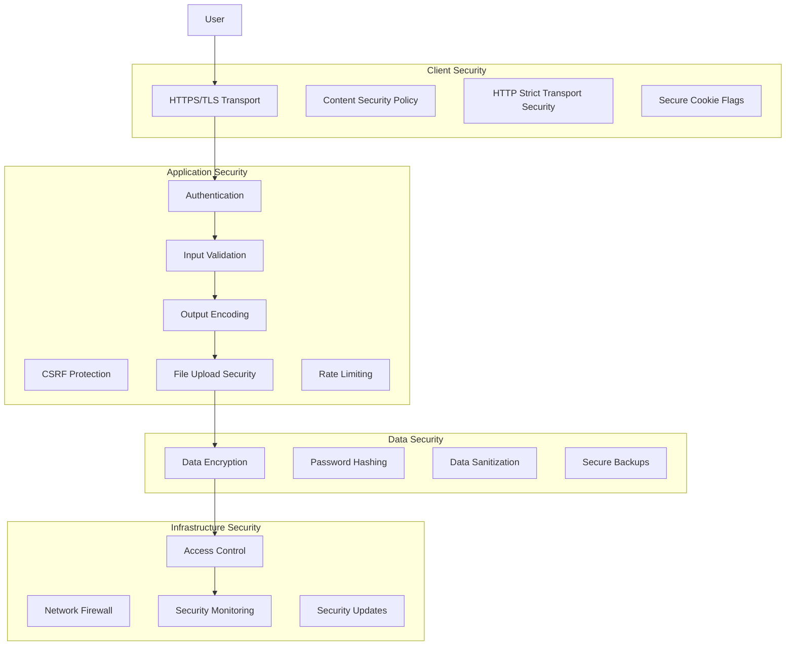
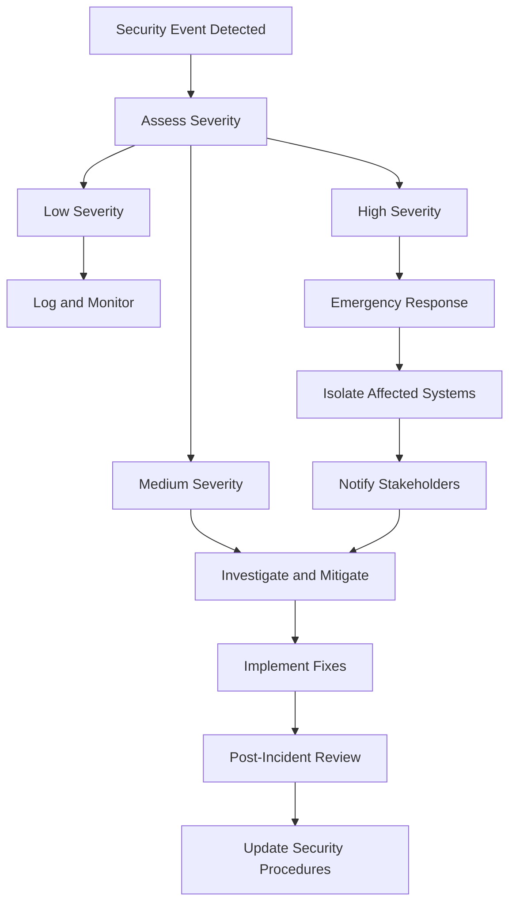

# Security Architecture Documentation

## Overview

Neocities implements a comprehensive security architecture with multiple layers of protection to safeguard user data, prevent abuse, and maintain system integrity.

## Security Model



## Authentication & Authorization

### Password Security

#### BCrypt Implementation
```ruby
# Password hashing with BCrypt
class Site < Sequel::Model
  def password=(new_password)
    self.password_hash = BCrypt::Password.create(new_password, cost: 12)
  end
  
  def password_valid?(password)
    BCrypt::Password.new(password_hash) == password
  rescue BCrypt::Errors::InvalidHash
    false
  end
end
```

**Security Features:**
- **Salt**: Automatic random salt generation
- **Cost Factor**: BCrypt cost of 12 (4,096 iterations)
- **Timing Attack Protection**: Constant-time comparison
- **Hash Verification**: Safe hash validation

#### Password Requirements
- Minimum 8 characters
- No maximum length restriction
- No character requirements (allows passphrases)
- Password strength meter guidance
- Protection against common passwords

### Session Management

#### Secure Session Configuration
```ruby
# app.rb - Session configuration
use Rack::Session::Cookie, 
  key: 'neocities',
  expire_after: 31556926, # 1 year
  secret: $config['session_secret'],
  httponly: true,          # Prevent XSS access
  secure: ENV['RACK_ENV'] == 'production', # HTTPS only in production
  same_site: :lax          # CSRF protection
```

**Security Features:**
- **HTTPOnly**: Prevents JavaScript access to session cookies
- **Secure**: HTTPS-only transmission in production
- **SameSite**: Protection against CSRF attacks
- **Expiration**: Automatic session timeout
- **Secret Rotation**: Regular session secret rotation

### Multi-Factor Authentication

#### Phone Verification
```ruby
# Phone verification implementation
def send_phone_verification(phone_number)
  code = SecureRandom.random_number(999999).to_s.rjust(6, '0')
  
  # Store hashed verification code
  self.phone_confirm_token = BCrypt::Password.create(code)
  self.phone_confirm_expires = Time.now + 10.minutes
  
  # Send SMS via Twilio
  $twilio.messages.create(
    to: phone_number,
    from: $config['twilio_phone'],
    body: "Your Neocities verification code is: #{code}"
  )
end
```

#### Email Verification
```ruby
def send_email_confirmation
  token = SecureRandom.urlsafe_base64(32)
  self.email_confirm_token = token
  self.email_confirm_expires = Time.now + 24.hours
  
  EmailWorker.perform_async({
    to: email,
    subject: 'Confirm your Neocities account',
    template: 'email_confirmation',
    token: token
  })
end
```

## Input Validation & Sanitization

### File Upload Security

#### MIME Type Validation
```ruby
class Site
  VALID_MIME_TYPES = %w{
    text/html text/css text/javascript text/plain
    image/png image/jpeg image/gif image/svg+xml image/webp
    font/woff font/woff2 font/ttf font/otf
    application/json application/xml
  }.freeze
  
  def valid_file_type?(filename:, tempfile:)
    # Check file extension
    extension = File.extname(filename).downcase
    return false unless ALLOWED_EXTENSIONS.include?(extension)
    
    # Verify MIME type with libmagic
    mime_type = Magic.open(:mime_type) { |m| m.file(tempfile.path) }
    return false unless VALID_MIME_TYPES.include?(mime_type)
    
    # Additional content validation
    validate_file_content(tempfile, mime_type)
  end
end
```

#### File Content Validation
```ruby
def validate_file_content(tempfile, mime_type)
  case mime_type
  when 'text/html'
    validate_html_content(tempfile)
  when /^image\//
    validate_image_content(tempfile)
  when 'text/javascript'
    validate_javascript_content(tempfile)
  else
    true
  end
end

def validate_html_content(tempfile)
  content = File.read(tempfile.path, encoding: 'UTF-8')
  
  # Check for dangerous content
  return false if content.match?(/<script[^>]*src=[^>]*>/i)
  return false if content.match?(/javascript:/i)
  return false if content.match?(/data:.*base64/i)
  
  # Validate with Nokogiri
  doc = Nokogiri::HTML::DocumentFragment.parse(content)
  true
rescue
  false
end
```

#### File Size Limits
```ruby
def file_size_too_large?(size)
  max_size = case plan_type
  when 'supporter'
    50.megabytes
  else
    10.megabytes
  end
  
  size > max_size
end

def storage_quota_exceeded?(additional_size = 0)
  total_size = site_files_dataset.sum(:size) || 0
  max_storage = case plan_type
  when 'supporter'
    50.gigabytes
  else
    1.gigabyte
  end
  
  (total_size + additional_size) > max_storage
end
```

### Input Sanitization

#### HTML Sanitization
```ruby
require 'sanitize'

def sanitize_html(content)
  Sanitize.fragment(content, 
    :elements => %w[
      b i u strong em p br div span h1 h2 h3 h4 h5 h6
      ul ol li a img blockquote code pre
    ],
    :attributes => {
      'a' => ['href', 'title'],
      'img' => ['src', 'alt', 'width', 'height'],
      'blockquote' => ['cite']
    },
    :protocols => {
      'a' => { 'href' => ['http', 'https', 'mailto'] },
      'img' => { 'src' => ['http', 'https'] },
      'blockquote' => { 'cite' => ['http', 'https'] }
    }
  )
end
```

#### Parameter Validation
```ruby
def validate_username(username)
  # Username requirements
  return false if username.blank?
  return false if username.length < 3 || username.length > 32
  return false unless username.match?(/\A[a-zA-Z0-9_-]+\z/)
  return false if RESERVED_USERNAMES.include?(username.downcase)
  true
end

def validate_email(email)
  return false if email.blank?
  return false if email.length > 254
  return false unless email.match?(URI::MailTo::EMAIL_REGEXP)
  
  # Check against disposable email blacklist
  domain = email.split('@').last.downcase
  return false if disposable_email_domain?(domain)
  
  true
end
```

## CSRF Protection

### Token Implementation
```ruby
# app.rb - CSRF protection
def csrf_token
  session[:csrf_token] ||= SecureRandom.base64(32)
end

def csrf_safe?
  return true if request.get? || request.head?
  return false unless session[:csrf_token]
  
  # Check token from form parameter or header
  provided_token = params[:csrf_token] || 
                   request.env['HTTP_X_CSRF_TOKEN']
  
  # Constant-time comparison
  Rack::Utils.secure_compare(
    session[:csrf_token], 
    provided_token.to_s
  )
end

# Automatic CSRF check
before do
  redirect '/' if request.post? && !csrf_safe?
end
```

### Template Integration
```erb
<!-- All forms include CSRF token -->
<form method="post" action="/upload">
  <%= csrf_token_input_html %>
  <!-- form fields -->
</form>
```

## Content Security Policy

### CSP Header Configuration
```ruby
after do
  csp_header = [
    "default-src 'self'",
    "script-src 'self' 'unsafe-inline' 'unsafe-eval' blob: https://hcaptcha.com https://*.hcaptcha.com https://js.stripe.com",
    "style-src 'self' 'unsafe-inline' https://hcaptcha.com https://*.hcaptcha.com",
    "img-src 'self' data: blob: https:",
    "font-src 'self' data:",
    "connect-src 'self' https://hcaptcha.com https://*.hcaptcha.com https://api.stripe.com",
    "frame-src 'self' https://hcaptcha.com https://*.hcaptcha.com https://js.stripe.com",
    "object-src 'none'",
    "base-uri 'self'"
  ].join('; ')
  
  response.headers['Content-Security-Policy'] = csp_header
end
```

### Security Headers
```ruby
# Additional security headers
response.headers['X-Frame-Options'] = 'DENY'
response.headers['X-Content-Type-Options'] = 'nosniff'
response.headers['X-XSS-Protection'] = '1; mode=block'
response.headers['Referrer-Policy'] = 'strict-origin-when-cross-origin'
response.headers['Strict-Transport-Security'] = 'max-age=31536000; includeSubDomains'
```

## Rate Limiting & DDoS Protection

### Application-Level Rate Limiting
```ruby
# Rate limiting implementation
class RateLimiter
  def initialize(redis, prefix, limit, window)
    @redis = redis
    @prefix = prefix
    @limit = limit
    @window = window
  end
  
  def allowed?(identifier)
    key = "#{@prefix}:#{identifier}"
    current = @redis.get(key).to_i
    
    if current >= @limit
      false
    else
      @redis.multi do
        @redis.incr(key)
        @redis.expire(key, @window)
      end
      true
    end
  end
end

# Usage
before '/api/*' do
  limiter = RateLimiter.new($redis, 'api_rate', 60, 60) # 60 requests per minute
  
  unless limiter.allowed?(request.ip)
    halt 429, { error: 'Rate limit exceeded' }.to_json
  end
end
```

### Upload Rate Limiting
```ruby
def check_upload_rate_limit
  key = "upload_rate:#{current_site.id}"
  uploads_count = $redis.get(key).to_i
  
  max_uploads = case current_site.plan_type
  when 'supporter'
    100 # uploads per hour
  else
    20  # uploads per hour
  end
  
  if uploads_count >= max_uploads
    halt 429, 'Upload rate limit exceeded'
  else
    $redis.multi do
      $redis.incr(key)
      $redis.expire(key, 3600) # 1 hour
    end
  end
end
```

## Spam & Abuse Prevention

### Anti-Spam Measures
```ruby
# Stop Forum Spam integration
def check_for_spam(ip_address, email, username)
  response = HTTP.get('http://api.stopforumspam.org/api', params: {
    ip: ip_address,
    email: email,
    username: username,
    f: 'json'
  })
  
  data = JSON.parse(response.body)
  
  # Check confidence scores
  ip_spam = data.dig('ip', 'confidence') || 0
  email_spam = data.dig('email', 'confidence') || 0
  username_spam = data.dig('username', 'confidence') || 0
  
  # Flag as spam if any confidence > 75%
  [ip_spam, email_spam, username_spam].any? { |score| score > 75 }
end
```

### Content Moderation
```ruby
# Automated content classification
def classify_content(content)
  # Use external service or ML model
  response = HTTP.post('https://api.moderation-service.com/classify', 
    json: { content: content }
  )
  
  result = JSON.parse(response.body)
  
  case result['classification']
  when 'spam', 'phishing'
    mark_as_spam
    notify_moderators
  when 'adult'
    mark_as_adult_content
  end
end
```

### IP Blocking
```ruby
# Automatic IP blocking for abuse
def check_blocked_ip(ip_address)
  # Check local blocklist
  return true if BlockedIp.where(ip_address: ip_address).any?
  
  # Check external reputation services
  dnsbl_result = check_dnsbl(ip_address)
  
  if dnsbl_result[:blocked]
    BlockedIp.create(
      ip_address: ip_address,
      reason: dnsbl_result[:reason],
      auto_blocked: true
    )
    true
  else
    false
  end
end
```

## Data Protection

### Data Encryption
```ruby
# Sensitive data encryption
class EncryptedField
  def self.encrypt(value)
    return nil if value.nil?
    
    cipher = OpenSSL::Cipher.new('AES-256-GCM')
    cipher.encrypt
    cipher.key = encryption_key
    iv = cipher.random_iv
    
    encrypted = cipher.update(value.to_s) + cipher.final
    tag = cipher.auth_tag
    
    # Return IV + tag + encrypted data
    Base64.strict_encode64(iv + tag + encrypted)
  end
  
  def self.decrypt(encrypted_value)
    return nil if encrypted_value.nil?
    
    data = Base64.strict_decode64(encrypted_value)
    iv = data[0, 12]
    tag = data[12, 16]
    encrypted = data[28..-1]
    
    cipher = OpenSSL::Cipher.new('AES-256-GCM')
    cipher.decrypt
    cipher.key = encryption_key
    cipher.iv = iv
    cipher.auth_tag = tag
    
    cipher.update(encrypted) + cipher.final
  rescue
    nil
  end
  
  private
  
  def self.encryption_key
    @encryption_key ||= Base64.decode64($config['encryption_key'])
  end
end
```

### PII Protection
```ruby
# Personal information handling
def anonymize_user_data(site)
  site.update(
    email: "deleted-#{site.id}@example.com",
    description: nil,
    phone_number: nil,
    real_name: nil
  )
  
  # Remove from analytics
  Stat.where(site_id: site.id).delete
  Event.where(site_id: site.id).delete
end
```

## Security Monitoring

### Audit Logging
```ruby
# Security event logging
def log_security_event(event_type, details = {})
  Event.create(
    site_id: current_site&.id,
    event_type: "security.#{event_type}",
    data: details.merge(
      ip_address: request.ip,
      user_agent: request.user_agent,
      timestamp: Time.now.iso8601
    )
  )
end

# Usage examples
log_security_event('login_attempt', { success: false, username: username })
log_security_event('password_change', { user_id: current_site.id })
log_security_event('suspicious_upload', { filename: filename, reason: 'invalid_mime_type' })
```

### Intrusion Detection
```ruby
# Anomaly detection
def detect_anomalies
  # Failed login attempts
  recent_failures = Event.where(
    event_type: 'security.login_attempt',
    created_at: (Time.now - 1.hour)..Time.now
  ).where("data->>'success' = 'false'")
  
  # Group by IP address
  failures_by_ip = recent_failures.group_by { |e| e.data['ip_address'] }
  
  failures_by_ip.each do |ip, events|
    if events.count > 10
      # Block IP temporarily
      create_temporary_block(ip, '1 hour', 'brute_force_attempt')
      notify_security_team("Brute force attempt from #{ip}")
    end
  end
end
```

### Vulnerability Scanning
```ruby
# Dependency vulnerability checking
desc 'Check for security vulnerabilities'
task :security_audit do
  # Check Ruby gems
  system('bundle audit check --update')
  
  # Check Node.js packages
  system('npm audit')
  
  # Custom security checks
  check_configuration_security
  check_file_permissions
  check_ssl_certificates
end
```

## Incident Response

### Security Incident Workflow


### Automated Response
```ruby
# Automated incident response
class SecurityIncidentHandler
  def handle_incident(severity, details)
    case severity
    when :critical
      emergency_response(details)
    when :high
      escalate_to_security_team(details)
    when :medium
      create_security_ticket(details)
    when :low
      log_for_review(details)
    end
  end
  
  private
  
  def emergency_response(details)
    # Immediate notifications
    notify_on_call_engineer(details)
    create_incident_channel(details)
    
    # Automatic mitigations
    if details[:attack_type] == 'ddos'
      enable_ddos_protection
    elsif details[:attack_type] == 'sql_injection'
      increase_waf_sensitivity
    end
  end
end
```

## Security Testing

### Automated Security Tests
```ruby
# Security test examples
describe 'Security Tests' do
  it 'prevents SQL injection' do
    malicious_input = "'; DROP TABLE sites; --"
    
    post '/signin', {
      username: malicious_input,
      password: 'password'
    }
    
    # Verify database wasn't compromised
    expect(Site.count).to be > 0
  end
  
  it 'prevents XSS attacks' do
    script_tag = '<script>alert("xss")</script>'
    
    site = create_site(description: script_tag)
    get "/#{site.username}"
    
    # Verify script is escaped
    expect(last_response.body).not_to include('<script>')
    expect(last_response.body).to include('&lt;script&gt;')
  end
  
  it 'enforces file upload restrictions' do
    malicious_file = create_tempfile('malicious.exe', 'MZ...') # PE header
    
    post '/upload', {}, {
      'rack.session' => { site_id: site.id },
      'CONTENT_TYPE' => 'multipart/form-data',
      'rack.input' => create_multipart_data(malicious_file)
    }
    
    expect(last_response.status).to eq(400)
    expect(JSON.parse(last_response.body)['error']).to include('file type')
  end
end
```

### Penetration Testing
- Regular automated vulnerability scans
- Annual third-party penetration testing
- Bug bounty program for responsible disclosure
- Security code reviews for critical changes